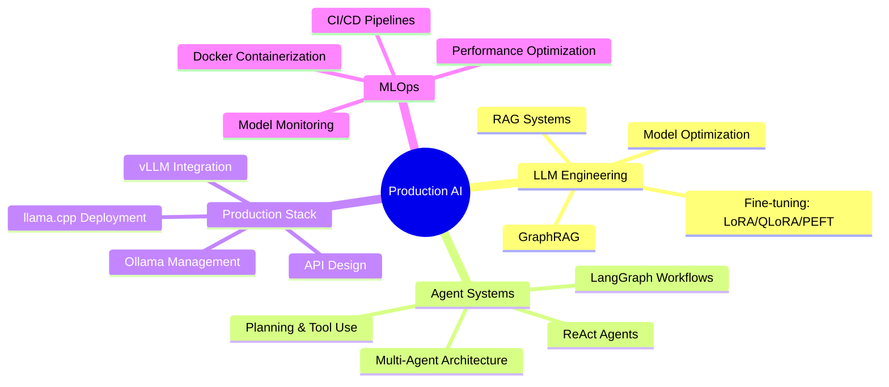

<div align="center">


</div>

<div align="center">
  
[](https://git.io/typing-svg)

</div>

---

## 👨‍💻 Professional Profile


```python
class SeniorLLMEngineer:
    def __init__(self):
        self.name = "Кайрат Жаксылыков"
        self.role = "Senior LLM Engineer & AI Systems Architect"
        self.experience = "1+ год в production LLM системах"
        self.location = "Казахстан 🇰🇿"
        
    def get_expertise(self):
        return {
            "llm_engineering": ["Production RAG", "GraphRAG", "Fine-tuning"],
            "agent_systems": ["Multi-Agent", "ReAct", "Planning Agents"],
            "ml_ops": ["Docker", "CI/CD", "Model Deployment"],
            "backend": ["FastAPI", "PostgreSQL", "API Design"]
        }
        
    def get_tech_stack(self):
        return ["PyTorch", "LangChain", "vLLM", "Docker", "PostgreSQL"]
```

<br clear="right"/>

---

## 🛠️ Core Technologies

<div align="center">

### 🤖 LLM & AI Engineering


### 🚀 Backend & Production


### 🗄️ Vector Databases & Search


### ⚙️ MLOps & Infrastructure


</div>

---

## 📊 GitHub Analytics

<div align="center">


</div>

---

## 🎯 Technical Expertise

<div align="center">



</div>

---

## 💼 Key Projects & Impact

<div align="center">

| 🚀 **Project** | 🛠️ **Tech Stack** | 📈 **Impact** |
|:---|:---|:---:|
| **Enterprise RAG System** | LangChain + FastAPI + ChromaDB + Docker | Production Ready |
| **Multi-Agent Workflow Engine** | LangGraph + ReAct + Planning Agents | Scalable Architecture |
| **GraphRAG Knowledge System** | Neo4j + LLM + Knowledge Graphs | Advanced Retrieval |
| **LLM Fine-tuning Pipeline** | LoRA + QLoRA + PEFT + Distributed Training | Model Optimization |
| **Production API Gateway** | FastAPI + PostgreSQL + Redis + Docker | High Performance |

</div>

---

## 🔧 Production Experience

<div align="center">

| 🎯 **Domain** | 💡 **Technologies** | ⚡ **Specialization** |
|:---|:---|:---|
| **LLM Deployment** | vLLM, llama.cpp, Ollama, TensorRT | High-throughput inference |
| **Agent Orchestration** | LangGraph, Multi-Agent Systems, Tool Integration | Complex workflow automation |
| **Vector Search** | ChromaDB, Pinecone, Weaviate, FAISS | Semantic retrieval systems |
| **Model Fine-tuning** | LoRA, QLoRA, PEFT, Distributed Training | Custom model adaptation |
| **Backend Architecture** | FastAPI, PostgreSQL, Redis, Docker | Scalable API design |

</div>

---

## 📈 Performance Metrics

<div align="center">

| 📊 **Metric** | 🎯 **Achievement** |
|:---:|:---:|
| **Production Systems** | 5+ deployed applications |
| **Model Implementations** | 12+ LLM integrations |
| **Agent Architectures** | 8+ multi-agent systems |
| **API Endpoints** | 25+ production endpoints |
| **Docker Deployments** | 15+ containerized services |

</div>

---

## 🤝 Professional Contact

<div align="center">

[](https://t.me/xyntherion)
[](mailto:zhaksylykov.k06@gmail.com)
[](https://github.com/Kairatzh)

### 💼 Available for:
`LLM Engineering` • `Multi-Agent Systems` • `Production AI` • `Enterprise Solutions` • `Technical Leadership`

</div>

---

<div align="center">

### 🎯 Value Proposition

**Proven track record in designing and deploying production-ready LLM systems with focus on scalability, performance, and enterprise-grade reliability.**

</div>

---

<div align="center">


</div>
