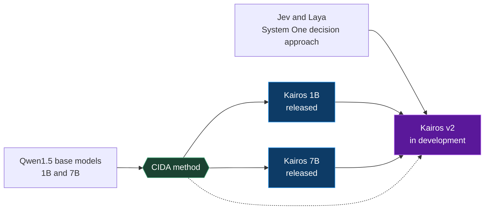
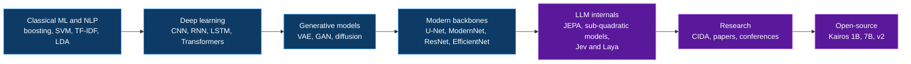

 

<!-- Add contact badges here, for example:

-->

 

<table align="center">
  <tr>
    <td align="center" width="25%"><h2>~2 years</h2>of full-time focus on machine learning</td>
    <td align="center" width="25%"><h2>2 models</h2>released open-source on Hugging Face (Kairos 1B and 7B)</td>
    <td align="center" width="25%"><h2>3 tracks</h2>of research papers: CIDA, Calibrated, MultiAgent</td>
    <td align="center" width="25%"><h2>ICPC</h2>university team lead in competitive programming</td>
  </tr>
</table>

 

> **I build models that know how sure they are.**
> Accuracy tells you how often a model is right. Calibration tells you when you can trust it. My research sits at that boundary, and the open-source Kairos models are where it becomes working code.

I am an ML/NLP/LLM researcher and engineer. For almost two years I have worked full time on machine learning, and in that time I moved from classical models to the frontier of generative modeling and language model research. I design models, train them, publish them and write about them.

My work is built around one principle: a model must be accurate, and it must also know how confident it is. That principle is the core of my research direction. It led me to **CIDA**, to a series of papers on calibration and multi-agent systems, and to the open-source **Kairos** models.

I combine research depth with engineering discipline. I understand how modern architectures work from the inside, and I can take an idea all the way to a trained, evaluated and published model. Alongside research I compete in algorithmic programming and lead my university ICPC team, which keeps my implementation skills sharp and my thinking about complexity honest.

 

### Kairos v2

I am developing the next generation of the Kairos model family. It combines CIDA with the **System One decision-model approach** that Jev and Laya brought into the field: compact models that return structured decisions with calibrated probabilities instead of free-form text. Such models are fast, cheap to run, and suited to agent pipelines where every decision must be measurable and trustworthy.

### Research papers

I am writing papers on CIDA, calibrated prediction and multi-agent systems, and I present this work at conferences. Each paper feeds the next Kairos release, and each release gives the papers something concrete to measure.

```mermaid
flowchart LR
    A["Qwen1.5 base models<br/>1B and 7B"] --> B{{"CIDA method"}}
    B --> C["Kairos 1B<br/>released"]
    B --> D["Kairos 7B<br/>released"]
    F["Jev and Laya<br/>System One decision approach"] --> E
    C --> E["Kairos v2<br/>in development"]
    D --> E
    B -.-> E

    classDef done fill:#0d3b66,stroke:#2e9ef7,color:#ffffff;
    classDef wip fill:#5a189a,stroke:#c77dff,color:#ffffff;
    classDef method fill:#1b4332,stroke:#52b788,color:#ffffff;
    class C,D done;
    class E wip;
    class B method;
```

 

### Kairos: open-source model family

Published on Hugging Face under the profile [kirtzh](https://huggingface.co/kirtzh).

| Model | Base Model | Method | Status |
|:------|:-----------|:-------|:-------|
| **Kairos 7B** | Qwen1.5-7B | CIDA | Released |
| **Kairos 1B** | Qwen1.5-1B | CIDA | Released |
| **Kairos v2** | Jev / Laya decision-model approach | CIDA | In development |

### Research directions

<table>
  <tr>
    <td width="33%" valign="top">
      <h4>CIDA</h4>
      The method behind every Kairos model. It targets the gap between what a model predicts and how reliably it knows that the prediction is right. Calibration is what makes a model usable in production, because downstream systems and agents need confidence scores they can act on.
    </td>
    <td width="33%" valign="top">
      <h4>Calibrated prediction</h4>
      Confidence estimation and reliability analysis: how to measure trustworthiness with metrics such as expected calibration error and Brier score, and how to compare CIDA against post-hoc methods.
    </td>
    <td width="33%" valign="top">
      <h4>Multi-agent systems</h4>
      Architectures where several agents plan, call tools and coordinate. My research asks how calibrated confidence from each agent can make the whole system more reliable and easier to debug.
    </td>
  </tr>
</table>

### Publications and talks

- Papers in progress: **CIDA**, **Calibrated** methods, **Multi-Agent** systems
- Participation in conferences, with a growing record of talks and submissions

 

Every stage below is something I trained, broke and rebuilt, not just read about.

```mermaid
flowchart LR
    S1["Classical ML and NLP<br/>boosting, SVM, TF-IDF, LDA"] --> S2["Deep learning<br/>CNN, RNN, LSTM, Transformers"]
    S2 --> S3["Generative models<br/>VAE, GAN, diffusion"]
    S3 --> S4["Modern backbones<br/>U-Net, ModernNet, ResNet, EfficientNet"]
    S4 --> S5["LLM internals<br/>JEPA, sub-quadratic models,<br/>Jev and Laya"]
    S5 --> S6["Research<br/>CIDA, papers, conferences"]
    S6 --> S7["Open-source<br/>Kairos 1B, 7B, v2"]

    classDef a fill:#0d3b66,stroke:#2e9ef7,color:#ffffff;
    classDef b fill:#5a189a,stroke:#c77dff,color:#ffffff;
    class S1,S2,S3,S4 a;
    class S5,S6,S7 b;
```

 

<table>
  <tr>
    <td width="50%" valign="top">

#### Generative Models and Computer Vision
- Variational autoencoders (VAE) and generative adversarial networks (GAN)
- Diffusion models: training, sampling, conditioning
- U-Net, ModernNet, ResNet, EfficientNet and other modern backbones
- Transfer learning and fine-tuning of pre-trained vision models
- Regularization, learning-rate scheduling, architecture optimization, GPU-accelerated training on large datasets

    </td>
    <td width="50%" valign="top">

#### LLM Research and Engineering
- Modern architectures: JEPA-style predictive learning, sub-quadratic sequence models, System One decision models (Jev, Laya)
- Fine-tuning with LoRA, QLoRA and PEFT for domain-specific applications
- RAG and GraphRAG system design
- Inference optimization: vLLM, TensorRT, llama.cpp, Ollama, AWQ and GPTQ quantization
- Advanced prompting: zero-shot, few-shot, chain-of-thought, ReAct, planning

    </td>
  </tr>
  <tr>
    <td width="50%" valign="top">

#### Multi-Agent Systems
- Multi-agent architecture with LangGraph, AutoGen and LangChain
- Planning agents and dynamic tool selection
- Integration of agents with external APIs and services
- Research on calibrated coordination between agents

    </td>
    <td width="50%" valign="top">

#### Deep Learning
- PyTorch: MLP, CNN, RNN, LSTM, GRU and Transformer models
- Hugging Face Transformers, Accelerate, PEFT, PyTorch Lightning
- Training loops, losses, schedulers, mixed-precision and multi-stage fine-tuning

    </td>
  </tr>
  <tr>
    <td width="50%" valign="top">

#### Classical Machine Learning
- Regression and classification: Linear, Ridge, Lasso, Logistic Regression, SVM, Decision Trees, Random Forest
- Ensembles: Gradient Boosting, XGBoost, LightGBM, CatBoost
- Clustering: K-Means, DBSCAN, Hierarchical
- Feature engineering, hyperparameter tuning, rigorous model validation

    </td>
    <td width="50%" valign="top">

#### Classical NLP
- Preprocessing, TF-IDF, Word2Vec, FastText, GloVe
- Text classification, sentiment analysis, topic modeling with LDA
- spaCy, NLTK, gensim
- Dialogue systems built on traditional NLP methods

    </td>
  </tr>
  <tr>
    <td colspan="2" valign="top">

#### Backend, MLOps and Retrieval
- FastAPI, PostgreSQL, Redis, API optimization for high load
- Docker, Docker Compose, GitHub Actions, GitLab CI
- MLflow, ClearML, LangSmith for tracking and evaluation
- Vector search with ChromaDB, FAISS, Pinecone, Weaviate and pgvector; hybrid search (BM25 plus dense) with cross-encoder reranking

    </td>
  </tr>
</table>

 

<table>
  <tr>
    <td width="50%" valign="top">
      <h4>Kairos and CIDA</h4>
      Open-source language models fine-tuned from Qwen1.5 (7B and 1B) with the CIDA method and published on Hugging Face.
    </td>
    <td width="50%" valign="top">
      <h4>Kairos v2</h4>
      Next-generation models built on the Jev and Laya decision-model approach, combined with CIDA. Currently in development.
    </td>
  </tr>
  <tr>
    <td width="50%" valign="top">
      <h4>Enterprise-style RAG system</h4>
      Retrieval-augmented generation with corporate process integration and hybrid search.
    </td>
    <td width="50%" valign="top">
      <h4>Multi-agent educational platform</h4>
      A LangGraph-based platform for educational process automation with stateful agents.
    </td>
  </tr>
  <tr>
    <td width="50%" valign="top">
      <h4>GraphRAG knowledge system</h4>
      Neo4j plus an LLM for semantic search over connected knowledge.
    </td>
    <td width="50%" valign="top">
      <h4>Classical ML and DL models</h4>
      Price prediction, data classification and risk assessment; CNN and LSTM architectures for image analysis and sequence processing.
    </td>
  </tr>
</table>

 

I lead my university team in the **ICPC**. Competitive programming gave me a strong base in algorithms, data structures, graph theory, dynamic programming and complexity analysis, and it shapes how I write efficient training and inference code. Working in a team under time pressure also trained the habits I use in research: fast hypothesis testing, clean implementation and careful verification.

 

<b>Programming Languages</b>

 

| Language | What I use it for |
|:---------|:------------------|
| **Python** | Primary language for research and production: async-first code, strict typing, pydantic v2, dependency injection, clean architecture, training pipelines, evaluation harnesses |
| **C++** | Performance-critical code, algorithmic solutions in ICPC, inference-level optimization, Python bindings |
| **SQL** | Query optimization, indexing strategy, transactions, analytical queries over experiment and application data |

<b>Machine Learning and Deep Learning Frameworks</b>

 

| Area | Tools |
|:-----|:------|
| **Deep learning core** | PyTorch for custom architectures, training loops, losses and fine-tuning; PyTorch Lightning for structured, reproducible training |
| **Transformers ecosystem** | Hugging Face Transformers, Accelerate, PEFT (LoRA, QLoRA), model publishing on the Hugging Face Hub |
| **Classical ML** | scikit-learn for baselines, pipelines and evaluation; XGBoost, LightGBM, CatBoost for gradient boosting |
| **Data processing** | numpy, pandas, polars for feature engineering and large-scale data preparation |

<b>Generative Modeling and Computer Vision</b>

 

- **Generative families**: variational autoencoders (VAE), generative adversarial networks (GAN), diffusion models
- **Backbones and segmentation**: U-Net, ModernNet, ResNet, EfficientNet
- **Training practice**: transfer learning, fine-tuning of pre-trained models, regularization, learning-rate schedulers, mixed-precision and GPU-accelerated training on large datasets
- **Representation learning**: JEPA-style predictive architectures and the ideas behind learning in latent space rather than in pixel or token space

<b>LLM Research and Orchestration</b>

 

- **Architectures I study and build on**: modern transformer language models, sub-quadratic sequence architectures, JEPA-style predictive learning, System One decision models (Jev, Laya)
- **Adaptation**: LoRA, QLoRA and PEFT fine-tuning for domain-specific models, including the CIDA-based Kairos family built on Qwen1.5
- **Orchestration**: LangChain for production pipelines and integrations, LangGraph for stateful multi-agent workflows, AutoGen for multi-agent research and prototyping
- **APIs and serving integration**: OpenAI API, Hugging Face Inference, vLLM
- **Prompt engineering**: zero-shot, few-shot, chain-of-thought, ReAct, planning-based prompting

<b>Calibration and Evaluation</b>

 

- **Calibration research**: confidence estimation, calibrated prediction, reliability analysis, the focus of CIDA and my Calibrated work
- **Metrics**: accuracy, precision, recall, F1, AUROC, Brier score, expected calibration error (ECE)
- **Post-hoc methods**: temperature scaling and Platt scaling as baselines for comparison with CIDA
- **Experiment discipline**: held-out validation, cross-validation, ablations, reproducible experiment tracking with MLflow and ClearML

<b>Natural Language Processing</b>

 

- **Classical pipeline**: tokenization, stemming, lemmatization, stop-word removal, text normalization and deduplication
- **Representations**: Bag-of-Words, TF-IDF, Word2Vec, FastText, GloVe, dense and domain-specific embeddings
- **Libraries**: spaCy for production NLP, NLTK for preprocessing, gensim for topic modeling and embeddings
- **Tasks**: text classification, sentiment analysis, topic modeling with LDA, dialogue systems built on traditional NLP methods
- **Retrieval-oriented text work**: chunking strategies for RAG, document preprocessing, semantic search

<b>Retrieval and Vector Search</b>

 

- **Vector stores**: ChromaDB for local work and prototyping, FAISS for low-level similarity search, Pinecone as a managed service, Weaviate for schema-aware search, pgvector inside PostgreSQL
- **Hybrid search**: BM25 combined with dense retrieval
- **Ranking**: cross-encoder reranking for precision on top results
- **Systems**: RAG and GraphRAG (Neo4j plus an LLM) for semantic search over private knowledge bases

<b>Backend and Infrastructure</b>

 

- **APIs**: FastAPI for REST services, async request handling, optimization for high-load environments
- **Data layer**: PostgreSQL as the primary store, Redis for caching, rate limits and session memory
- **Containers and delivery**: Docker with multi-stage builds, Docker Compose, CI/CD with GitHub Actions and GitLab CI, environment-based configuration, rollback-ready deployments
- **Monitoring and tracking**: MLflow for experiments and model registry, ClearML for pipeline orchestration, LangSmith for LLM tracing and evaluation

<b>Inference and Performance Optimization</b>

 

- **Serving engines**: vLLM for high-throughput LLM serving, TensorRT for GPU optimization
- **Local and edge inference**: llama.cpp, Ollama
- **Compression**: AWQ and GPTQ quantization
- **Runtime techniques**: dynamic batching, KV-cache reuse, streaming inference

<b>Algorithms and Computer Science Foundations</b>

 

- **Competitive programming**: ICPC-level work with graph algorithms, dynamic programming, data structures, number theory, greedy methods and complexity analysis
- **Engineering habits from contests**: fast hypothesis testing, careful edge-case analysis, clean and efficient implementation under time pressure
- **Mathematics for ML**: linear algebra, probability and statistics, optimization, information theory as they apply to training, calibration and generative modeling

<b>Working Practices</b>

 

- Research to production path: idea, prototype, controlled experiment, published model, documented result
- Code quality: typing, modular architecture, code review, development standards
- Reproducibility: pinned environments, configuration through environment variables, tracked experiments and versioned models

 

<picture>
  <source media="(prefers-color-scheme: dark)" srcset="https://raw.githubusercontent.com/kairatzh/kairatzh/output/github-snake-dark.svg" />
  <source media="(prefers-color-scheme: light)" srcset="https://raw.githubusercontent.com/kairatzh/kairatzh/output/github-snake.svg" />
  
</picture>

 

